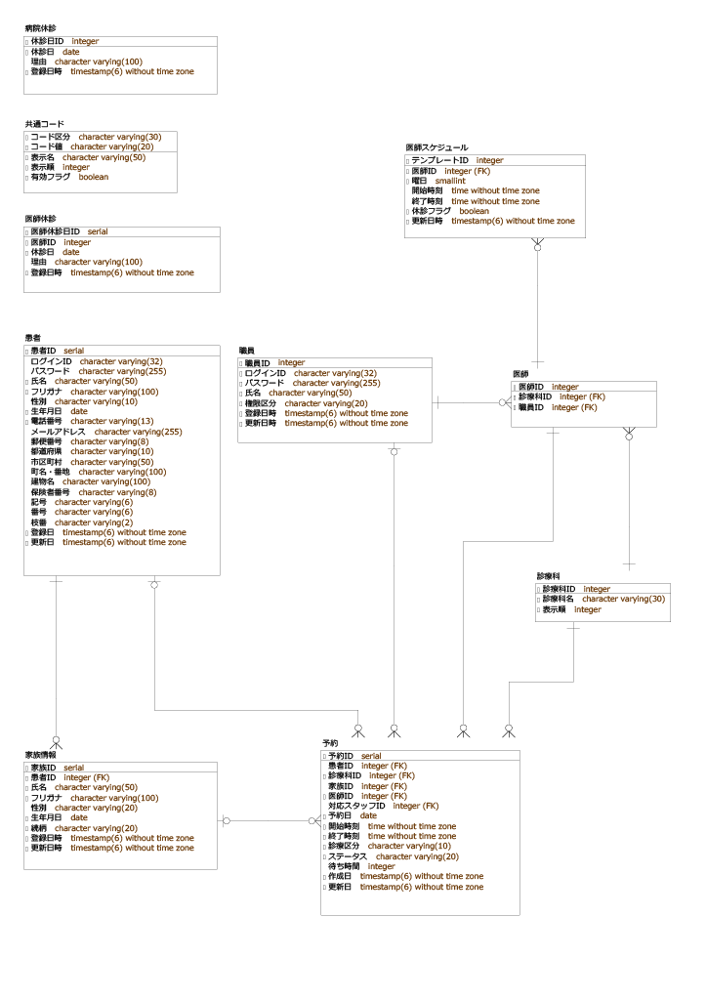
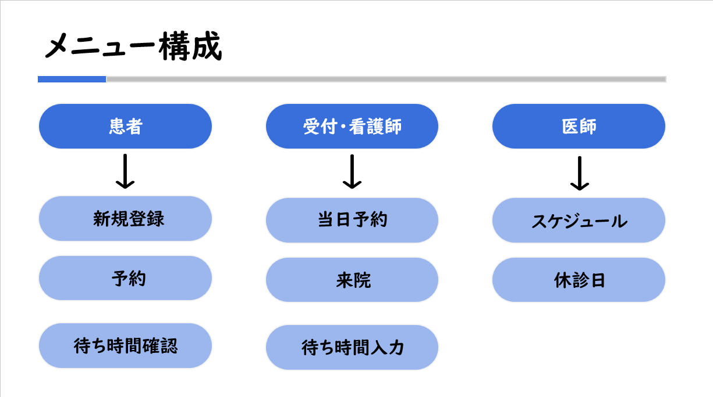
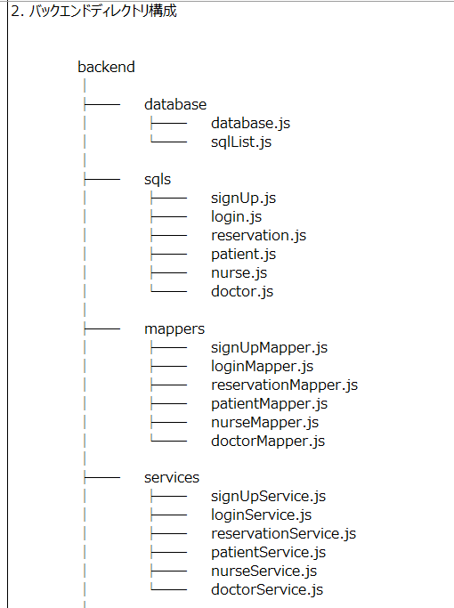
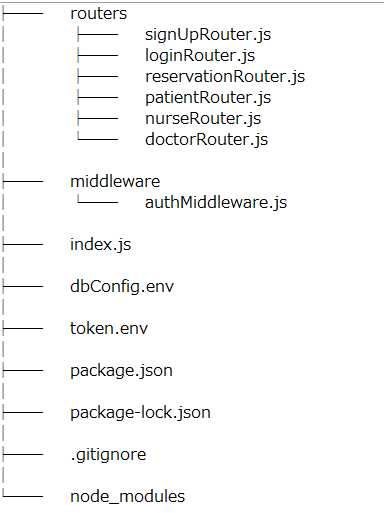
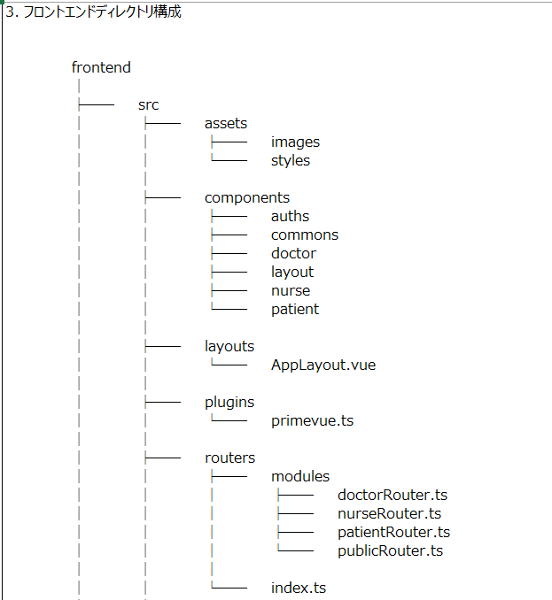
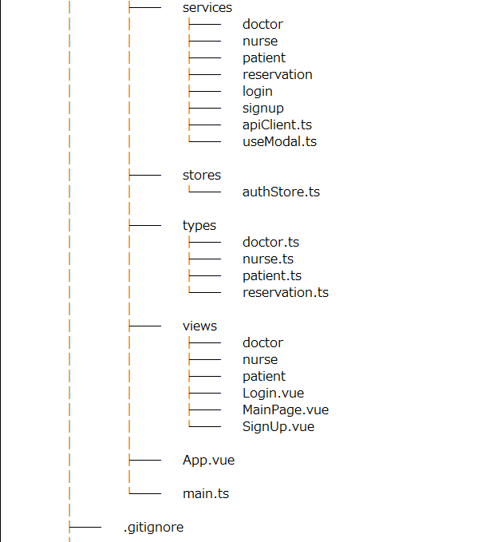
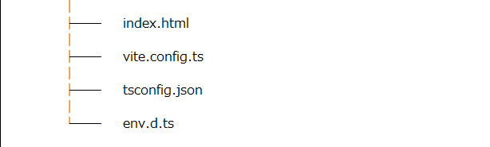

# 医療予約システム（個人プロジェクト）

## 📋 プロジェクト概要

Vue.jsによるWebアプリケーションの理解を深める。
- Pinaを利用した、状態管理について学ぶ。
- Vue.jsのリアクティビティー復習。

JavascriptによるPostgreSQLアクセスの基礎を学ぶ。
- Node.jsからPostgreSQLへ接続する方法を学ぶ。
- Javascriptによる３層アーキテクチャを復習

AIを活用した開発手法および機能の実装を学ぶ。
- AIの出力結果を検証・修正し、「AI協調開発」のプロセスを習得する。
- AIアシスタントに対する適切なプロンプトの設計・入力スキルを磨き、
   コーディングや設計の効率を最大化する方法を学ぶ。

---   

## 🎯 プロジェクト目的
WEB予約
- 「さくら総合クリニック」における従来の電話および対面窓口中心の運用をリニーアル、業務効率の向上を図る。

待ち時間
- 患者が待ち時間や混雑状況を確認するために来院する負担を軽減するため、リアタイムでの情報共有を実現する。

セキュリティ
- パスワードの暗号化、アクセス権限の厳格な管理、不正アクセス対策する。

---

## 🛠️ 環境

| 区分 | 使用技術・ツール |
|------|----------|
| 分析・設計 | A5:SQL Mk-2 |
| IDE | VSCode |
| AI | GitHub Copilot, ChatGPT, Gemini, M365Copilot |
| ソースコード管理 | GitHub |
| データベース | PostgreSQL |
| フロントエンド | Vue.js, HTML, CSS, JavaScript, TypeScript, PrimeVue, Pinia |
| バックエンド | Node.js, express, JWT, bcryptjs |

---

## 📊 ERD図

> 総テーブル数：10個
---

## 🗺️ サイト構成図

---

## 🛠️ 実装機能

> ※ 新規登録, ログイン, 予約, 来院, 待ち時間, スケジュール変更

---

## 📁 ディレクトリ構造

